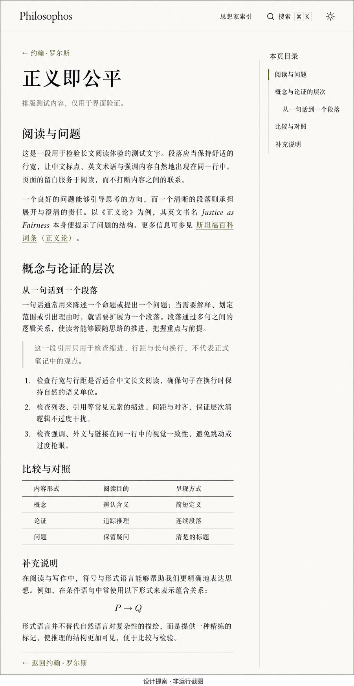

# Philosophos 设计与实现记录

2026-09-06：用户已查看完整阅读页概念、实际初稿与整站截图，明确确认“可以，按当前效果完成首版”。以下区分历史提案与最终采用的方案。

## 最终确认

- 文集式气质：浅暖纸色、墨色正文、灰橄榄链接；中文系统宋体、西文 Georgia、导航系统无衬线。没有远程字体请求或新增字体依赖。
- 默认跟随系统，支持手动明暗切换；暗色采用深墨绿灰背景与暖灰文字。
- 参考本机 `investment-research/site/theme/styles.css` 的实际阅读参数：正文 17px、行高 1.85、正文上限 920px，桌面目录 220px、间距 74px。只读参考仓库，没有修改其中的内容或配置。较窄桌面收缩间距，960px 以下折叠目录。
- 左上角 Philosophos 返回主页；删除顶栏“思想家索引”链接和首页同名大标题。首页以站名和人物条目组成。
- 人物页只显示姓名、可选 summary 和篇目。用户明确取消人物导读正文展示，源 Markdown 保留。首页人物列表与人物篇目列表的首项上方保留一条分隔线，后续条目之间继续分隔；篇目标题不再另画重复线。
- 人物页返回链接为“回到Philosophos”（读取站名配置）；文章上方与底部统一为“返回约翰·罗尔斯”（读取所属人物名）。无左侧常驻栏，正文与目录之间没有长竖线；目录只保留自身轨道与当前标记。隐藏目录滚动条，保留滚动与长标题换行。
- 内容固定为“思想家 → 具体笔记”，取消 `group`。排序按已填写 order、数字升序、中文标题、源文件路径。
- 保留 SlimSearch 引擎，定制简洁弹层，显示归属、支持键盘和焦点恢复；无历史、无自动建议。
- 不新增宣传副标题、阅读进度、完成记录或不可靠的修订日期。

## 预览与修订

第一轮方案正文较窄（约 720px、19px/1.95），用户在真实预览后要求采用参考仓库的行宽与行距，最终已修订为上述参数。概念图中的竖向分隔、人物导读、顶栏索引和较松版式均已被后续明确反馈取代。

实际交付截图：

- [首页，1440px](../screenshots/home-desktop.png)
- [人物页，1440px](../screenshots/thinker-desktop.png)
- [长文测试阅读页，1440px](../screenshots/reading-desktop.png)
- [长文测试阅读页暗色](../screenshots/reading-dark.png)
- [手机阅读，390px](../screenshots/reading-mobile.png)

长文图中文字是 `tests/fixtures/site/` 中的界面验证材料，不属于用户的哲学笔记。正式首页只有罗尔斯，人物 summary 尚未填写时自然省略。

## 模板基准

- 工作区：`/Users/yangyixin03/Workspace/philosophos`；开始时为空目录。
- 来源：<https://github.com/0xkoa1a/vuepress-notes-template>。
- 分支：`main`。
- 提交：`2fc150be8c06af4f82e3292d8a0f31bb4a39139c`（`ci: use Node 24 compatible actions`）。该提交标题指 Actions 的运行时；项目自身仍要求 Node 22。
- 基线检查时 `origin` 指向模板，尚未创建远端或发布；后续发布授权见 README。
- 使用 Node `22.18.0`、pnpm `11.19.0`，执行 `pnpm install --frozen-lockfile`，锁文件未改变。

已阅读根目录维护规则、说明、依赖与锁文件、Node 配置、Makefile、站点及 VuePress 配置、内容扫描和侧栏实现、客户端配置、页面与目录组件、共享样式、导出模板与导出器、内容检查、单元测试、浏览器导出测试、Pages 与安全工作流。

## 基线验证（2026-09-06）

所有命令通过 `fnm exec --using=22.18.0` 使用仓库要求的 Node。

| 检查 | 结果 |
| --- | --- |
| `make check` | 通过，2 个模板 Markdown 页面 |
| `pnpm run typecheck` | 通过 |
| `pnpm test` | 通过，3 个内容测试及 5 个导出策略测试 |
| `pnpm run docs:build` | 通过，生成 2 个内容页面及 404 页面 |
| `pnpm run export:smoke` | 通过，4 项 Chromium 浏览器测试 |
| `git diff --check` | 通过 |

最初的 `make check` 和 `pnpm test` 因沙箱禁止 tsx 创建本地 IPC 管道而失败；取得执行权限后，未改动检查命令即通过。构建有模板已有的超过 500 kB 分包警告。导出测试有 `NO_COLOR` 与 `FORCE_COLOR` 环境提示，测试通过。

使用临时内容目录和当前 VuePress 实际 `app.pages` 验证的路由：

| 源 Markdown | `page.path` | 静态输出文件 |
| --- | --- | --- |
| `index.md` | `/` | `index.html` |
| `rawls/index.md` | `/rawls/` | `rawls/index.html` |
| `rawls/justice-as-fairness.md` | `/rawls/justice-as-fairness.html` | `rawls/justice-as-fairness.html` |

临时测试目录已移除。这项检查确认 VuePress 页面解析结果，尚不代表完成最终站点在根路径和子路径下的浏览器验收。

通过仅监听本机的静态服务器，在 Codex 内置浏览器访问模板构建产物。打开搜索并输入“知识库”，可以检索到首页中文正文；对搜索框发送 Esc 可以关闭弹层，但 `document.activeElement` 回到 body，未返回搜索按钮。正式实现需补充焦点恢复。完整搜索键盘流程、结果归属、窄屏与部署 base 留待实现后验证。

## 可复用与需调整的部分

- 保留 VuePress 2、Vue 3、Vite、default theme 扩展方式、SlimSearch、KaTeX、Mermaid、ECharts 和已有导出能力。
- `lib/content.ts` 可复用递归发现与 YAML 解析；扩展元数据校验与思想家聚合。
- `plugins/sidebar.ts` 目前按目录名显示分组，并替换文件扩展名生成链接；需要改为读取人物入口元数据，并使用 VuePress 的实际页面路径。
- `ArticleToc.vue` 可复用标题采集，但当前 CSS 仅在 1440px 以上显示目录，长标题省略；需要可换行、可滚动的目录及窄屏展开方式。
- 正式模板演示内容只有 `notes/index.md` 和 `notes/test/test.md`。`tests/export-page.spec.ts` 的纯文本导出用例依赖后者，移除生产演示时需同步迁入测试目录。
- 现有导出器支持 `--source-dir`，VuePress 配置支持 `VUEPRESS_SOURCE_DIR`，可在此基础上隔离长文及多人物测试内容。测试产物必须使用单独输出目录，不能覆盖生产产物或进入生产搜索。

## 本轮结果

完整检查结果、浏览器流程、发现并修复的问题与剩余限制见 [validation.md](../validation.md)。用户已确认本地首版，并于 2026-09-06 授权新建公开仓库 `0xkoa1a/philosophos`、提交、推送及 Pages 发布。
